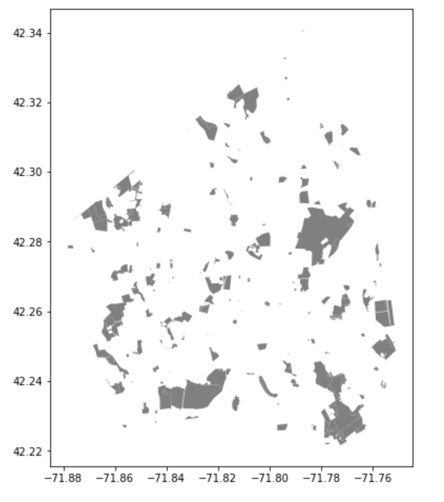

# Visually Analyzing Green Space in Worcester by Environmental Justice Census Block Group (CBG) Presence
This tutorial was created by Kyle Pecsok as a final project for Professor Shadrock Robert's 'Computer Programming for GIS' course at Clark University. If you have any questions please feel free to email me at kpecsok@clarku.edu.

### Things needed for this tutorial
- A Google Colab account, unless you have another coding software and know how to connect input data to the code, and place data created in the code to a new output folder.

- A Carto account, however even if you don't have a Carto account you can still produce the necessary shapefiles you just won't be able to create the same maps that I did.

### Some notes on Carto 

If you have GitHub you can connect it to a Carto account, however if you have a free version of Carto please keep the following in mind.

- You can only produce a maximum of three private and three public maps.

- Each map can have only up to four layers.

- You can only have a maximum of ten datasets in your account.

With this tutorial we will not exceed these limits however if you made maps before on Carto and have the free version then you may reach one of these limits before being able to produce all of the maps.

### Background on the GeoPandas Library for the Tutorial

[GeoPandas](https://geopandas.org/) is a library that is an extension of the Pandas library (a library with functions similar to Excel). However, unlike Pandas, GeoPandas can perform spatial operations on geometric files. GeoPandas has these operations performed from the Shapely package. In addition, to perform the operations needed for this tutorial GeoPandas relies on the packages rtree and spatial index as dependencies, meaning it depends on those packages to run. The GeoPandas operations that will be used for this tutorial are explained in the following section.

## Introduction to the Tutorial
For this tutorial you will learn how to use the GeoPandas library in Python to create a few different maps within Carto that shows the presence of green space within Worcester, and how the presence of green space varies in Worcester Census Block Groups (CBGs) that are deemed Environmental Justice  with all criteria, Environmental Justice with some criteria and CBGs that are not deemed Environmental Justice. Keep reading to learn what an Environmental Justice CBG with some or all criteria are. 

Below are the following maps that will be created for this tutorial. If you wish to view these maps on Carto there is a link next to each image, which will send you to Carto to show an interactive version of that map. This is very helpful in allowing viewers to examine where in Worcester green space, Environmental Justice CBGs are, and where Worcester green space is located within Environmental Justice CBGs. Using Carto is a great way to look interactively look at the locations of the shapefiles based on street and landmarks, for instance through this map I can zoom in and see which CBGs surrounding Clark University (my institution) considered Environmental Justice CBGs. You will notice that thought at in addition I have a map showing tree cover in Worcester. This was a map that I created using Worcester tree cover data, however this data is not allowed for public use so I will not be sharing it, but if you are interested in seeing how I got the tree cover data into this Carto Map, I will have a section explaining this. Perhaps if you want to add additional data to your map that I didn't include, it could potentially be helpful to review the tree cover section.

While the maps I made were intended specifically for Worcester, you can do these maps for any town in Massachusetts with the data I provided. In the instructions of this tutorial I will explain how you can choose to do a different Massachusetts town. Here are the maps below:

**[Worcester Environmental Justice CBG Map](https://kpecsok98.carto.com/builder/08cf7549-84d4-4e3b-8d22-1ce2592218f1/embed)** 

**[Worcester Green Space Map](https://kpecsok98.carto.com/builder/c70eedb3-c9cf-47bf-8a6e-a16cd3b029b4/embed)** 

**[Worcester Tree Cover Map](https://kpecsok98.carto.com/builder/42b670c2-c66d-46ab-8fec-18f9314589f8/embed)** 


In this tutorial you will learn to do the following operations with the GeoPandas library:

**Project**: Switch the Coordinate Reference System (CRS) of a shapefile. To see where I figure out how to do this with GeoPandas, click on this [link](https://geopandas.org/projections.html).

**Clip**: Create a new shapefile by cutting out the input shapefile to fit within the Clip feature shapefile. To see where I figured out how to do this with GeoPandas, click on this [link](https://geopandas.org/reference/geopandas.clip.html)

**Select by Attribute**: Create a new shapefile by selecting certain criteria within a shapefile. To see where I figured out how to do this with GeoPandas, click on this [link](https://gis.stackexchange.com/questions/303365/using-geopandas-shapely-and-fiona-to-select-state-from-shapefile-save-it-and).

**Difference**: Create a new shapefile by removing parts of the input shapefile that fall within another shapefile. This is the equivalent to the Erase Operation in ArcMap. To see where I figured out how to do this with GeoPandas, click on this [link](https://geopandas.org/set_operations.html).

Overall this tutorial is a great way to create maps with simple geometric operations that can reveal useful information. This tutorial can particularly be helpful to anyone who does not have access to ArcMap to perform these spatial operations and create maps.


### Objective 
Having green space and tree cover, particularly in urban communities, can provide many benefits that grey infrastructure can't provide such as inhibiting the impacts of the Urban Heat Island Effect, absorbing pollutants, and reducing the risk of flooding and erosion (Hebbert and Jankovi, 2011; Burger et al., 2017). In addition, they can provide mental and physical health benefits to residents who in live in areas with these spaces (Wolch et al., 2014; Sallis and Ganz, 2009). 

However, studies show that spaces disproportionately lie within communities that are white and affluent (Boone at al., 2009; Wolch et al., 2014). Through this tutorial the objective is to see if it appears through visualization that this is the case in Worcester as well. To do this, the tutorial will lead the user to create layers that show the presence of green space in non-Environmental Justice CBGs and Environmental Justice CBGs. Well what is an Environmental Justice neighborhood? An [Environmental Justice Neighborhood](https://docs.digital.mass.gov/dataset/massgis-data-2010-us-census-environmental-justice-populations) as defined by the Massachusetts Executive Office of Energy and Environmental Affairs has to fulfill one or more of the following criteria:

1. Have a minority population that is >= 25% as of 2010.

2. A 2010 median household income of less than $40,673.

3. Have >= 25% of households that are English isolated, meaning there's no one in a household over 14 years of age who speaks only English or doesn't speak English at home but overall speaks it very well as of 2010.

In addition to comparing green space distribution in Environmental Justice CBGs and non-Environmental Justice CBGs this tutorial will also show how to compare green space distribution in Environmental Justice CBGs that satisfy all three criteria, and Environmental Justice CBGs that satisfy only some criteria. Lastly, it is also important to note that these qualifications for Environmental Justice CBGs are only used for CBGs in Massachusetts.

### Data Needed for this Lab
All the data needed is available in the data folder of this repo, but if you would like to see where it came from the links are attached.

1. Massachusetts Towns(CENSUS2010TOWNS_POLY.shp): The data is available at this [link](https://docs.digital.mass.gov/dataset/massgis-data-datalayers-2010-us-census) and contains all the 351 towns of Massachusetts.

2. Environmental Justice CBG (EJ_POLY.shp): The data is available at this [link](https://docs.digital.mass.gov/dataset/massgis-data-2010-us-census-environmental-justice-populations) and contains all the Environmental Justice CBGs within Massachusetts. 

3. Green Space (OPENSPACE_POLY.shp): The data is available at this [link](https://docs.digital.mass.gov/dataset/massgis-data-protected-and-recreational-openspace) and represents all conservation lands and outdoor recreational facilities. 

4. Tree Cover (UTCWooManualEdits_20150907_AElmes.shp): This shapefile is not available for use. This data was produced by former Clark PhD student Arthur Elemes and represents the tree cover in all of Worcester. 


## Tutorial
Please note that this tutorial is run on the assumption that the user is using Google Colab. So when connecting the input data and placing the output data, you will need to determine how to do this if you're not using Google Colab. If you're using Google Colab be sure to upload data to your Google Drive.

### Part 1 (Importing Libraries and Downloading Data)
First download all the libraries that will be needed for this lab. **If you are not using Colab you may need to install Pandas, if you're using Colab you don't because Pandas is already installed in the Google Colab Environment.**
```Python
# Add the needed packages to Colab Environment
!pip install geopandas
!apt-get install -y libspatialindex-dev
!pip install rtree

# Import the needed packages once they're installed
import pandas as pd # an interface is provided through this library to interact with tabular data
import geopandas as gpd # combines panda's capabilities with those of shapely to perform geospatial operations
import rtree # needed for doing the geometric operations with geopandas 
from shapely.geometry import Point, Polygon, MultiPolygon  # manipulates text data into geospatial shapes
from shapely import wkt  # stands for "well known text," allows for the interchange of data across GIS programs
```


Next you will want to organize the data. I recommend creating a folder called Worcester_EJ_Greenspace as I did, and then create a folder called 'input' folder within the Worcester_EJ_GreenSpace folder. In addition, create the following folders within the Worcester_EJ_GreenSpace folder, 'Worcester', 'Worcester_EJ_all', 'Worcester_EJ_some', 'Worcester_EJ_all_greenspace', 'Worcester_EJ_some_greenspace', and 'Worcester_greenspace_NonEJ'. I will explain in Part 3 why you need all of these folders. If you're using Colab, before inputting the data you need to write the following code to connect Colab to your Drive.

```Python
from google.colab import drive
drive.mount('/content/gdrive') # connects Colab to your Google Drive
root_path = 'gdrive/My Drive/Worcester_EJ_GreenSpace/' # set root path to folder where you uploaded the data
```


Once Colab is connected to your Drive type in the following code. Again, please note that if you are NOT using Colab you should NOT use this exact code to connect to your input data. Also, for anyone, don't attempt to download the tree_cover data, I am only including it to show you how I used this specific data to include in a Carto map. If there is data that I did not provide that you would like to use feel free to import it.

```Python
# Import shapefiles
environmentaljustice = gpd.read_file(root_path+'input/EJ_POLY.shp') # Shapefile of Massachusetts Environmental Justice CBGs
greenspace = gpd.read_file(root_path+'input/OPENSPACE_POLY.shp') # Shapefile of Massachusetts open space areas 
towns = gpd.read_file(root_path+'input/CENSUS2010TOWNS_POLY.shp') # Shapefile of Massachusetts towns
tree_cover = gpd.read_file(root_path+'input/UTCWooManualEdits_20150907_AElmes.shp') # You will not import this shapefile for the tutorial
```

### Part 2 (Checking Shapefile Projection and Reprojecting Data)
For data to be used in Carto they all need to have the WGS 1984 Coordinate Reference System (CRS). However, we don't know what the CRS of our data is just from simply downloading it. Luckily, there is a way to check the CRS. First let's check the CRS of ```environmentaljustice```. To do this type the following code.

```Python
# Check the Coordinate Reference System of environmentaljustice
environmentaljustice.crs
```

You're output should look like the following.  Clearly this is shapefile is not set to the WGS 1984 CRS. Let's check the other shapefiles.

```Python
# Check the Coordinate Reference System of greenspace
greenspace.crs
```

```Python
# Check the Coordinate Reference System of towns
towns.crs
```

For this treecover data I'm only doing this because I have the data. If you decide to add any of your own data just type it out the same way to check its CRS.

```Python
# Check the Coordinate Reference System of tree_cover
tree_cover.crs
```

You should see that none of the data has the CRS we need to upload to Carto. This means we will need to project it to the WGS 1984 CRS. First we will reproject  ```environmentaljustice``` by typing the following code.

```Python
# Project environmentaljustice to the WGS 1984 CRS
environmentaljustice = environmentaljustice.to_crs("EPSG:4326")
```
The EPSG code 4326 is the specific code for the WGS 1984 CRS. So in order to project the other data to this CRS, just do the same thing as above, except now replace ```environmentaljustice``` with ```greenspace``` and ```towns```.

```Python
# Project greenspace to the WGS 1984 CRS
greenspace = greenspace.to_crs("EPSG:4326")
```

```Python
# Project towns to the WGS 1984 CRS
towns = towns.to_crs("EPSG:4326")
```

I also projected the tree_cover data. Again this is not data that you as the user of this tutorial use, but if you have any extra data feel free to project that if it needs to be.

```Python
# Project tree_cover to the WGS 1984 CRS
tree_cover = tree_cover.to_crs("EPSG:4326")
```

Now let's check the CRS of one of the files we initially downloaded. Let's check the CRS of  ```environmentaljustice```.

```Python
# Check the new Coordinate Reference System of environmentaljustice
environmentaljustice.crs
```

You should now get this output.  

Now check the new CRS for the other data and make sure they all have the same output with a WGS 1984 CRS.

```Python
# Check the new Coordinate Reference System of greenspace
greenspace.crs
```

```Python
# Check the new Coordinate Reference System of towns
towns.crs
```

This is what I did to check to make sure I had the correct projection for the tree_cover data.

```Python
# Check the new Coordinate Reference System to tree_cover
tree_cover.crs
```

### Part 3 (Create new shapefiles)

Now that we have all our data in the correct CRS, let's start creating new shapefiles. First, we are going to perform a select by attribute in our towns data, where we will select WORCESTER. In the code below I am selecting within the towns attribute file, an item in the TOWN column that are Worcester, which in other words means that of all the Massachusetts towns I'm only selecting Worcester for my new shapefile. While ```Worcester``` is not yet a shapefile, I will show later in this section how to convert it to a shapefile. Keep in mind if you would like you can do this with another Massachusetts town, just be sure you type it in all caps like with WORCESTER below.


```Python
#From Massachusetts towns file select by attribute to get Worcester
Worcester = towns[towns['TOWN']=="WORCESTER"] #Within TOWN column of attribute table select WORCESTER
```
To see and get familiar with this Worcester data type the following code.

```Python
# Check data of 1 row of Worcester 
Worcester.sample(1)
```

You should get an output that looks like this. 


Now let's do the same thing, but type it out as this.

```Python
# Check data of 2 rows of Worcester 
Worcester.sample(2)
```

Did you get a message like this?


If you you did then that is actually a good sign. Since we only selected one row when we did Select by Attribute, ```Worcester``` only has 1 row which means that we can't sample two rows of this data. So if we have an error by typing ```Worcester.sample(2)```, it's a good sign that you did the Select by Attribute correctly. Another way to check to see if you created  ```Worcester``` type out this code.

```Python
# Create a map of Worcester
Worcester.plot(column='TOWN', color='grey', figsize=(16,8));
```

Does your ouput look like this? 


If it does great! That polygon is of the city of Worcester. If your output doesn't look like that, go back and make sure that you did all of the prior steps correctly. For the rest of the tutorial I'll show you how to do this with the other GeoDataFrames we create. While it may overall seem tedious and a little time-consuming to do, it will be very useful to do to ensure that our GeoDataFrames are correct before converting them to shapefiles and placing them into Carto.

Next we want to take the Environmental Justice CBG shapefile and do a Select by Attribute again. Just like with the towns data we will select items in the TOWNS column that is Worcester, which means we will select Environmental Justice CBGs that are in Worcester to create a new GeoDataFrame of these types of CBGs that are solely within Worcester.

```Python
# From Environmental Justice Block group file select by attribute to get Worcester
Worcester_EJ = environmentaljustice[environmentaljustice['TOWN']== "WORCESTER"] # Within TOWN column of attribute table select WORCESTER
```

Now let's check to see if ```Worcester_EJ``` looks correct. Type out the code below.

```Python
# Create a map of Worcester Environmental Justice CBGs
Worcester_EJ.plot(column='TOWN', color='grey', figsize=(16,8));
```

Does your output look like this? 

 

Then perfect, you sucessfully created the Worcester_EJ GeoDataFrame.

Even though we have a GeoDataFrame now that contains Environmental Justice CBGs in Worcester, there's still more we need to do. We don't just want to compare green space in Environmental Justice CBGs and Non-Environmental CBGs, we also want to see how green space in Worcester compares in Environmental Justice CBGs that fulfill all three criteria, and Environmental Justice CBGs that fulfill some criteria. If you want to see what the criteria are, go back to the Objective section of this tutorial where I list off the three Environmental Justice criteria. So first let's work to create a shapefile that is of Environmental Justice CBGs that fulfill all three criteria, we will do this again through a Select by Attribute. In this code below we simply just select Environmental CBGs within Worcester that satisfy all three criteria, which means we only select those CBGs that have a ```CRIT_CNT``` (short for Criteria Count) that is equal to three.

```Python
# From Worcester Environmental Justice Block Group file select by attribute to select Block Groups with all three criteria.
Worcester_EJ_all = Worcester_EJ[Worcester_EJ['CRIT_CNT']==3] # Within CRIT_CNT column of attribute select block groups with a value of 3.
```

Again, let's just check and make sure ```Worcester_EJ_all``` looks correct. Type out this code below.

```Python
# Create a map of Worcester Environmental Justice CBGs that fulfill all criteria
Worcester_EJ_all.plot(column='TOWN', color='grey', figsize=(16,8));
```

The output should look like this. 


Now we want to work towards creating a shapefile of Environmental Justice CBGs in Worcester that only fulfill some criteria. To do thiis we will type pretty similar code as last time except we will want ```CRIT_CNT``` to be values of less than 3, in other words we are selecting by attribute for Environmental Justice CBGs that fulfill less than three criteria.

```Python
# From Worcester Environmental Justice Block Group file select by attribute to select Block Groups with all three criteria.
Worcester_EJ_some = Worcester_EJ[Worcester_EJ['CRIT_CNT']<3] # Within CRIT_CNT column of attribute select block groups with a value less than 3.
```

Again type in the following code to create a map of your GeoDataFrame.

```Python
# Create a map of Worcester Environmental Justice CBGs that fulfill some criteria
Worcester_EJ_some.plot(column='TOWN', color='grey', figsize=(16,8));
```
Your output should look like this. 


Next we want to create GeoDataFrames that contain data of green space exclusively in Worcester. We can do this with a Clip. First let's clip ```greenspace``` within Worcester by typing the following code. 

```Python
# Clip greenspace within Worcester
Worcester_greenspace = gpd.clip(greenspace, Worcester)
```

Type the code below to see what the GeoDataFrame looks like mapped.

```Python
# Create a map of Worcester greenspace
Worcester_greenspace.plot(column='TOWN_ID', color='grey', figsize=(16,8));
```
It should look like this.



Now we have a GeoDataFrame of green space within the Worcester city limits. In our final maps though we want to see where are the green space thats fall within Worcester EJ CBGs that fulfill some or all criteria. Next let's create a GeoDataFrame of green space that fall within Worcester EJ CBGs that fulfill all criteria.

```Python
# Clip the Worcester greenspace file within the Worcester Environmental Justice block groups with all criteria file
Worcester_EJ_all_greenspace = gpd.clip(Worcester_greenspace, Worcester_EJ_all)
```

Type the code below to see what the GeoDataFrame looks like mapped.

```Python
# Create a map of Worcester greenspace that's within Environmental Justice block groups with all criteria
Worcester_EJ_all_greenspace.plot(column='TOWN_ID', color='grey', figsize=(16,8));
```

It should look like this. 


Now we'll create a GeoDataFrame of green spaces within Worcester EJ CBGs that only fulfill some criteria.

```Python
# Clip the Worcester greenspace file within the Worcester Environmental Justice block groups with some criteria file
Worcester_EJ_some_greenspace = gpd.clip(Worcester_greenspace, Worcester_EJ_some)
```

Type the code below to see what the GeoDataFrame looks like mapped.
```Python
# Create a map of Worcester greenspace that's within Environmental Justice block groups with some criteria
Worcester_EJ_some_greenspace.plot(column='TOWN_ID', color='grey', figsize=(16,8));
```
It should look like this. 


Lastly, we want to create a GeoDataFrame that contains of Worcester green space that is not within an EJ CBG, regardless of how many criteria it has. To do this type the following code.

```Python
# Erase Worcester greenspace within areas that Worcester Environmental Justice block groups are in
Worcester_greenspace_NonEJ = gpd.overlay(Worcester_greenspace, Worcester_EJ, how = 'difference')
```
One last time, type the code below to see what the GeoDataFrame looks like mapped.

```Python
# Create a map of Worcester greenspace that's not within an Environmental Justice block group
Worcester_greenspace_NonEJ.plot(column='TOWN_ID', color='grey', figsize=(16,8));
```
The output should look like this. 


If all the outputs for the GeoDataFrames created look correct, we are now done with creating GeoDataFrames. When I initially created this tutorial I was hopeful that I could clip the tree cover data within the EJ CBGs with all and some criteria, but unfortunately by Google Colab crashed multiple times when trying to do so :(. So instead, I just ended up showing the projected tree_cover data in a Carto data, however the code below shows how I would have clipped the tree_cover data had it worked. 

```Python
# Code to clip treecover within the Worcester Environmental Justice block groups file
'''
Worcester_EJ_all_treecover = gdp.clip(tree_cover, Worcester_EJ_all)
'''
```

```Python
# Code to clip Worcester treecover within the Worcester Environmental Justice block groups with some criteria file
'''
Worcester_EJ_some_treecover = gdp.clip(tree_cover, Worcester_EJ_some)
'''
```

```Python
# Code to erase Worcester treecover data that are within the Environmeantl Justice block groups.
'''
Worcester_treecover_NonEJ = gpd.overlay(tree_cover, Worcester_EJ, how = 'difference')
'''
```

Next we need to convert all the GeoDataFrames that we created and want to use in our Carto map to shapefiles. Note that if you decide to use very fine/detailed data or data that is large like I did with tree cover this process could take some time. For me with the tree cover data it took about 30 minutes.


```Python
Worcester.to_file('Worcester.shp') # Shapefile of Worcester
Worcester_EJ_all_greenspace.to_file('Worcester_EJ_all_greenspace.shp') # Shapefile of greenspace that lies within Worcester EJ  CBGs that fulfill all criteria
Worcester_EJ_some_greenspace.to_file('Worcester_EJ_some_greenspace.shp') # Shapefile of greenspace that lies within Worcester EJ CBGs that fulfill some criteria
Worcester_greenspace_NonEJ.to_file('Worcester_greenspace_NonEJ.shp') # Shapefile of greenspace that doesn't lie within Worcester EJ CBGs
Worcester_EJ_all.to_file('Worcester_EJ_all.shp') # Shapefile of Worcester EJ CBGs that fulfill all criteria
Worcester_EJ_some.to_file('Worcester_EJ_some.shp') # Shapefile of Worcester EJ CBGs that fulfill some criteria
tree_cover.to_file('tree_cover.shp') # Shapefile of Worcester treecover
```
Now that we have a shapefile we should copy the shapefile components to an ouput folder. In the code the name of the output folder I'm putting a shapefile in is the name as the shapefile. The reason for this is because Carto will take zip files to upload rather than invidual .shp files so it will be easier to organize the data when you upload a Zip folder that has the same name as the shapefile. This is why I asked for all of those folders to be made back in Part 1.

```Python
# Copy components of shapefile to Google Drive
!cp Worcester.cpg 'gdrive/My Drive/Worcester_EJ_GreenSpace/Worcester'
!cp Worcester.dbf 'gdrive/My Drive/Worcester_EJ_GreenSpace/Worcester'
!cp Worcester.prj 'gdrive/My Drive/Worcester_EJ_GreenSpace/Worcester'
!cp Worcester.shp 'gdrive/My Drive/Worcester_EJ_GreenSpace/Worcester'
!cp Worcester.shx 'gdrive/My Drive/Worcester_EJ_GreenSpace/Worcester'
```

```Python
# Copy components of shapefile to Google Drive
!cp Worcester_EJ_all.cpg 'gdrive/My Drive/Worcester_EJ_GreenSpace/Worcester_EJ_all'
!cp Worcester_EJ_all.dbf 'gdrive/My Drive/Worcester_EJ_GreenSpace/Worcester_EJ_all'
!cp Worcester_EJ_all.prj 'gdrive/My Drive/Worcester_EJ_GreenSpace/Worcester_EJ_all'
!cp Worcester_EJ_all.shp 'gdrive/My Drive/Worcester_EJ_GreenSpace/Worcester_EJ_all'
!cp Worcester_EJ_all.shx 'gdrive/My Drive/Worcester_EJ_GreenSpace/Worcester_EJ_all'
```

```Python
# Copy components of shapefile to Google Drive
!cp Worcester_EJ_all_greenspace.cpg 'gdrive/My Drive/Worcester_EJ_GreenSpace/Worcester_EJ_all_greenspace'
!cp Worcester_EJ_all_greenspace.dbf 'gdrive/My Drive/Worcester_EJ_GreenSpace/Worcester_EJ_all_greenspace'
!cp Worcester_EJ_all_greenspace.prj 'gdrive/My Drive/Worcester_EJ_GreenSpace/Worcester_EJ_all_greenspace'
!cp Worcester_EJ_all_greenspace.shp 'gdrive/My Drive/Worcester_EJ_GreenSpace/Worcester_EJ_all_greenspace'
!cp Worcester_EJ_all_greenspace.shx 'gdrive/My Drive/Worcester_EJ_GreenSpace/Worcester_EJ_all_greenspace'
```

```Python
# Copy components of shapefile to Google Drive
!cp Worcester_EJ_some_greenspace.cpg 'gdrive/My Drive/Worcester_EJ_GreenSpace/Worcester_EJ_some_greenspace'
!cp Worcester_EJ_some_greenspace.dbf 'gdrive/My Drive/Worcester_EJ_GreenSpace/Worcester_EJ_some_greenspace'
!cp Worcester_EJ_some_greenspace.prj 'gdrive/My Drive/Worcester_EJ_GreenSpace/Worcester_EJ_some_greenspace'
!cp Worcester_EJ_some_greenspace.shp 'gdrive/My Drive/Worcester_EJ_GreenSpace/Worcester_EJ_some_greenspace'
!cp Worcester_EJ_some_greenspace.shx 'gdrive/My Drive/Worcester_EJ_GreenSpace/Worcester_EJ_some_greenspace'
```

```Python
# Copy components of shapefile to Google Drive
!cp Worcester_EJ_some.cpg 'gdrive/My Drive/Worcester_EJ_GreenSpace/Worcester_EJ_some'
!cp Worcester_EJ_some.dbf 'gdrive/My Drive/Worcester_EJ_GreenSpace/Worcester_EJ_some'
!cp Worcester_EJ_some.prj 'gdrive/My Drive/Worcester_EJ_GreenSpace/Worcester_EJ_some'
!cp Worcester_EJ_some.shp 'gdrive/My Drive/Worcester_EJ_GreenSpace/Worcester_EJ_some'
!cp Worcester_EJ_some.shx 'gdrive/My Drive/Worcester_EJ_GreenSpace/Worcester_EJ_some'
```

```Python
# Copy components of shapefile to Google Drive
!cp Worcester_greenspace_NonEJ.cpg 'gdrive/My Drive/Worcester_EJ_GreenSpace/Worcester_greenspace_NonEJ'
!cp Worcester_greenspace_NonEJ.dbf 'gdrive/My Drive/Worcester_EJ_GreenSpace/Worcester_greenspace_NonEJ'
!cp Worcester_greenspace_NonEJ.prj 'gdrive/My Drive/Worcester_EJ_GreenSpace/Worcester_greenspace_NonEJ'
!cp Worcester_greenspace_NonEJ.shp 'gdrive/My Drive/Worcester_EJ_GreenSpace/Worcester_greenspace_NonEJ'
!cp Worcester_greenspace_NonEJ.shx 'gdrive/My Drive/Worcester_EJ_GreenSpace/Worcester_greenspace_NonEJ'
```

```Python
# Copy components of shapefile to Google Drive
!cp tree_cover.cpg 'gdrive/My Drive/Worcester_EJ_GreenSpace/tree_cover'
!cp tree_cover.dbf 'gdrive/My Drive/Worcester_EJ_GreenSpace/tree_cover'
!cp tree_cover.prj 'gdrive/My Drive/Worcester_EJ_GreenSpace/tree_cover'
!cp tree_cover.shp 'gdrive/My Drive/Worcester_EJ_GreenSpace/tree_cover'
!cp tree_cover.shx 'gdrive/My Drive/Worcester_EJ_GreenSpace/tree_cover'
```

### Part 4 (Uploading shapefiles to Carto)

Once you copy the shapefile components to Google Drive, you should download each folder that you put outputs in. Once you download these Zip files you don't need to unzip as you can just upload them to Carto as a Zip file. The name of folder that you download from Google Drive then upload to Colab should have the same name as the shapefile components that are within the folder. If you are not doing this with Colab make sure that your output folder is Zipped before uploading it to Carto. 

Once you log onto Carto go to your Dashboard and click on the blue button that says 'New Map', then click 'Create Empty Map'. Once you click that button you will have an empty map. The first map we will create will show the locations of the Worcester Environmental Justice CBGs that fulfill all criteria, and the Environmental Justice CBGs that fulfill only some of the criteria. First edit the title of this map by clicking the name of the map in the top left corner and call it 'Worcester EJ Map'. Next, we want to download the 'Worcester.shp' file. To do this click 'Add New Layer', and then upload the zip file called 'Worcester'.

Click on the three dots next to the layer name and click 'Edit layer'. Next, click on the Style tab and change the Stroke size to 5. Next, change the colors and transparencies of the polygon and stroke to what is shown below.

Polygon color and transparency adjustment:


Stroke color and transparency adjustment:


Next we will want to add the 'Worcester_EJ_some' and the 'Worcester_EJ_all' data to Carto, so like with the Worcester data click 'Add New Layer' and upload these two zip files. 

Once these data are uploaded let's make the following edits to the Worcester_EJ_all data on Carto. First on the three circles next to the Worcester_EJ_all data and then click edit layer. Once you do this click on the name of the file at the top and double click on it then type 'Worcester EJ All Criteria'. Next, click on the Style tab and leave everything as default except for the color and transparency of the polygon. Click on the Polygon color line to adjust the colors and transparencies of it to what is shown in the image below. 


Then click on the Legend tab, under Select Style click Custom Legend, and then there should be an option to type in the name of the legend item that is already in the color you chose. In the legend type in 'EJ CBG ALL CRITERIA'. 

Now let's do edits for the Worcester_EJ_some data. Again, click on the three dots next to the Worcester_EJ_some data and then click edit layer. Once you do this click on the name of the file at the top and double click on it then type 'Worcester EJ Some Criteria'. Next, click on the Style tab and leave everything as default except for the color and transparency of the polygon. Click on the polygon color line to adjust the colors and transparencies of it to what is shown in the image below. 


Now let's add to the legend, so follow the same steps as done for the other polygon and type 'EJ CBG SOME CRITERIA'.

If you want to check to make sure your map looks good feel free to look up at the map I produced at the top of the tutorial.

Now we'll make another map. Go back to the dashboard and do the same thing as before. This time name the map 'Worcester Greenspace Map', and once again add the Worcester layer and edit the stroke and polygon colors and transparencies like for the Worcester EJ Map. 

Once you download the Worcester data, download the Zipfiles that contain, ''Worcester_greenspace_NonEJ.shp', 'Worcester_EJ_some_greenspace.shp', 'Worcester_EJ_all_greenspace.shp'. After these Zipfiles are downloaded first click 'Edit layer' for the 'Worcester_greenspace_NonEJ' layer. Like with the other layers change the name of it to Worcester Green Space No EJ Criteria, and look at the image below to see what the colors and transparencies of the polygon should be.


Then in the legend add the name 'GREEN SPACE IN NO EJ CRITERIA CBG'

Now edit the Worcester_EJ_some_greenspace layer and change the name to 'Worcester Green Space Some EJ Critera' and look at the image below to see how to set the color and transparency of the polygon.


Again, go to the legend tab and add the name 'GREEN SPACE IN SOME EJ CRITERIA CBG'

Lastly, edit the Worcester_greenspace_NonEJ layer and change the name to 'Worcester Green Space All EJ Critera' and look at the image below to see how to set the color and transparency of the polygon.


Then in the legend type 'GREEN SPACE IN ALL EJ CRITERIA CBG'.

If you want to check to make sure this maps looks good feel free to look up at the map I produced at the top of the tutorial. Also, if you have any other maps to make with additional data you used feel free to do so like I did with the Tree Cover data.

Once you have made your maps you can decide whether or not you wish to keep it private or public. If you wish to make it public click Publish in the page of your map and set it to 'Public with Link'. If you have the free version of Carto keep in mind the number of public or private maps you have already produced, since you can only have three of each kind of map with that version of Carto.

#### Creating a Map on Carto with Tree Cover Data (Optional to Follow)
As mentioned this is data that was not provided for the tutorial, and this is just an explanation of the steps I took to create this map, which I called 'Worcester Tree Cover Map'. Like with the other maps I created on Carto, the Worcester data was uploaded and I adjusted the color and transparency of this data to be the same as this layer was in the other two maps. Next, I uploaded the tree cover data and changed the name of it to Worcester Tree Cover. The images below show how I altered the color of that polygon.


Lastly, I just went to the Legend tab and typed in 'Tree Cover in Worcester' as the first and only legend item and that was it.

### Conclusion
Now that you have the maps you can really compare the distribution of Green Space between EJ CBGs and non EJ CBGs of Worcester through visualization. As I mentioned near the beginning of this tutorial you can do this with other Massachusetts towns, you would just need to make sure that there are EJ CBGs or more than one CBG in the town you're looking at if you want to compare the amount of Green Space in EJ and Non-EJ CBGs. Even if the Massachusetts town you look at doesn't have one or both of those things you can still do this tutorial with another Massachusetts town to just simply show the town's Green Space distribution.

I hope you enjoyed doing this tutorial and creating these new shapefiles to produce a neat interactive map that you can share with others. If you wish to learn more about GeoPandas library click on this [link](https://geopandas.org/). Lastly, if you have any questions or face any issues during this tutorial feel free to email me at kpecsok@clarku.edu.

### References

Boone, C. G., Buckley, G. L., Grove, J. M., & Sister, C. (2009). Parks and people: An environmental justice inquiry in Baltimore, Maryland. Annals of the Association of American Geographers, 99(4), 767–787. https://doi.org/10.1080/00045600903102949

Burger, J., Davis, V., Franklin, J., Zipper, C., Skousen, J., Barton, C., & Angel, P. (2017). Forest Reclamation Advisories no 6: Tree-Compatible Ground Covers for Reforestation and Erosion Control. (6), 8. Retrieved from https://arri.osmre.gov/FRA/Advisories/Advisories.shtm

Hebbert, M., & Jankovic, V. (2013). Cities and climate change: the precedents and why they matter. Urban Studies, 50(7), 1332–1347. Retrieved from https://doi.org/10.1177/0042098013480970

Wolch, J. R., Byrne, J., & Newell, J. P. (2014). Urban green space, public health, and environmental justice: The challenge of making cities “just green enough.” Landscape and Urban Planning, 125, 234–244. https://doi.org/10.1016/j.landurbplan.2014.01.017


